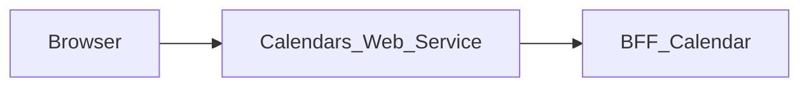

# Calendars_Web_Service — Documentation technique

## Destinations frontend explicites (MAIR-177)

Les redirections utilisent uniquement des URL HTTP(S) configurées, sans
identifiants intégrés. Aucun repli implicite vers localhost. Renseigner à
l’exécution les variables existantes `LOGIN_FRONT_URL` (fronts protégés) et
`PROJECT_FRONT_URL` (destination par défaut de Login), même en local. Login
accepte toujours un retour vers un front autorisé si sa destination par défaut
manque. Sans destination Login valide, le middleware répond 503 sans cache ;
Login affiche un état indisponible sans formulaire si aucune destination ne
peut être résolue. Aucun contrat API/BFF ni variable de déploiement ajouté.


[Présentation du module](module.md) · [English](../en/technical.md) · [README](../../README.md)

## Architecture et traitement des requêtes

Application Next.js 15.5.25, React 19 et TypeScript avec App Router. Le navigateur appelle les routes de la même origine; le serveur Next.js relaie les données vers **BFF_Calendar**.



La page assemble les composants calendrier avec `useCalendarPage`. Le hook charge le bootstrap, gère la période et les mutations; les routes de données gardent le préfixe `/calendar`. Le shell et la page profil utilisent séparément les adaptateurs de session.

Au premier montage, le hook lit les paramètres facultatifs `date` (`YYYY-MM-DD`) et `event` (identifiant). Une date valide sélectionne son mois avant la première requête `/calendar/bootstrap`, évitant de charger inutilement le mois courant. Après un bootstrap réussi, l’événement correspondant s’ouvre dans la fenêtre de détails existante. Une date invalide conserve le mois courant; un événement absent laisse la date sélectionnée sans ouvrir de fenêtre. Le lien ne donne aucun accès au-delà des données renvoyées par le BFF.

Le proxy générique lit le contrat OpenAPI versionné pour autoriser chemins et méthodes. Il ne transmet qu’une liste d’en-têtes autorisés (`Accept`, `Accept-Language`, `Content-Type`, en-têtes conditionnels, `User-Agent`, `X-Request-Id`), ne relaie un corps que si l’opération en déclare un et dans un type de contenu déclaré (sinon 415), limite les corps à 1 Mio (413), conserve paramètres de requête, statuts et réponses du BFF, désactive le cache et n’effectue pas de suivi automatique des redirections. Son délai est de 15 secondes.

## Données et persistance

Les sources et limites suivantes concernent le BFF associé, dont dépend la sauvegarde des données affichées.

Calendar API fournit les opérations sur les événements. `calendarAccessRepository.ts` accède directement à PostgreSQL pour l’annuaire, les affectations, certaines modifications et les métadonnées. La table `calendar_event_metadata`, créée par le BFF si nécessaire, référence `events.id` et stocke catégorie, service, lieu et récurrence. Les catégories et services comprennent des référentiels définis dans les helpers.

Le fonctionnement dépend d’identifiants utilisateurs cohérents entre Core et Calendar et du schéma SQL attendu. Le stack Docker utilise la base partagée du stack BFF User; démarrer celui-ci en premier. Les métadonnées et accès SQL restent une responsabilité actuelle du BFF.

L’état React gère l’affichage et les opérations en cours. Ce dépôt ne définit pas de base métier propre; les garanties de sauvegarde sont celles du BFF et de ses sources décrites ci-dessus.

## Installation et lancement local

Utiliser Node.js 22 pour reproduire le job de contrats et npm avec le fichier de verrouillage versionné. Les versions des autres jobs et de Docker sont précisées plus bas.

Les dépendances privées `@mairie360/*` nécessitent un accès GitHub Packages. Configurer `NODE_AUTH_TOKEN` dans l’environnement avec un jeton autorisé à lire ces packages, conformément à `.npmrc`. Ne pas enregistrer la valeur dans Git.

```bash
npm ci
```

Créer `.env.local` à la racine. Exemple pour des BFF exécutés sur la même machine:

```dotenv
BFF_CALENDAR_BASE_URL=http://localhost:4002
USER_BFF_URL=http://localhost:4000
```

Démarrer le BFF associé et BFF User pour les parcours de session, puis lancer le web service. Le port `5002` ci-dessous est un choix local explicite pour éviter les collisions; ce n’est pas une affirmation sur les ports de tous les fichiers Compose.

```bash
npm run dev -- --port 5002
```

Ouvrir `http://localhost:5002`. Pour exécuter le build avec le script Next.js:

```bash
npm run build
npm run start -- --port 5002
```

## Configuration

Si la session manque ou a expiré, le middleware transmet `redirect` à Login. Il construit la destination avec `CALENDAR_FRONT_URL` lu à l’exécution, puis le chemin et la query demandés, jamais avec l’hôte interne de l’ingress. Sans URL publique valide, Login utilise sa destination Projets par défaut.

Les valeurs ci-dessous sont des exemples locaux ou des comportements explicitement indiqués, pas des identifiants de production.

| Variable ou priorité | Exemple / repli indiqué | Rôle |
| --- | --- | --- |
| `BFF_CALENDAR_BASE_URL` → `CALENDAR_BFF_URL` → `NEXT_PUBLIC_BFF_CALENDAR_BASE_URL` | http://localhost:4002 | Priorité de gauche à droite dans le proxy; configurer explicitement une URL HTTP(S). Une configuration absente ou invalide renvoie un 503 non mis en cache, sans appel réseau. |
| `USER_BFF_URL` → `BFF_USER_API_URL` | http://localhost:4000 | Priorité propre aux adaptateurs de session vers BFF User; une URL HTTP(S) explicite est aussi requise. |
| `BFF_CONTRACT_DIR` | ../BFF_Calendar/contracts | Répertoire des contrats BFF pour les scripts de synchronisation et de contrôle. |
| `COOKIE_DOMAIN` | — | Domaine des cookies; vérifier sa cohérence avec Login et BFF User. |
| `ADMINISTRATION_FRONT_URL` | — | Destination de navigation; voir le fichier source qui la lit. Les variables injectées par `next.config.ts` ou préfixées `NEXT_PUBLIC_` sont publiques et prises en compte lors du build. |
| `CALENDAR_FRONT_URL` | — | Destination de navigation; voir le fichier source qui la lit. Les variables injectées par `next.config.ts` ou préfixées `NEXT_PUBLIC_` sont publiques et prises en compte lors du build. |
| `ELEARNING_FRONT_URL` | — | Destination de navigation; voir le fichier source qui la lit. Les variables injectées par `next.config.ts` ou préfixées `NEXT_PUBLIC_` sont publiques et prises en compte lors du build. |
| `EMAIL_FRONT_URL` | — | Destination de navigation; voir le fichier source qui la lit. Les variables injectées par `next.config.ts` ou préfixées `NEXT_PUBLIC_` sont publiques et prises en compte lors du build. |
| `FILES_FRONT_URL` | — | Destination de navigation; voir le fichier source qui la lit. Les variables injectées par `next.config.ts` ou préfixées `NEXT_PUBLIC_` sont publiques et prises en compte lors du build. |
| `LOGIN_FRONT_URL` | — | Destination de navigation; voir le fichier source qui la lit. Les variables injectées par `next.config.ts` ou préfixées `NEXT_PUBLIC_` sont publiques et prises en compte lors du build. |
| `MESSAGE_FRONT_URL` | — | Destination de navigation; voir le fichier source qui la lit. Les variables injectées par `next.config.ts` ou préfixées `NEXT_PUBLIC_` sont publiques et prises en compte lors du build. |
| `PROJECT_FRONT_URL` | — | Destination de navigation; voir le fichier source qui la lit. Les variables injectées par `next.config.ts` ou préfixées `NEXT_PUBLIC_` sont publiques et prises en compte lors du build. |

Dans un conteneur, `localhost` désigne le conteneur lui-même. Utiliser le nom DNS du service BFF sur le réseau Docker, ou une adresse d’hôte accessible. Les fichiers Compose incluent parfois d’autres services et des paramètres hérités; vérifier les URL et ports effectifs avant de les employer.

## Routes et contrat de données

Inventaire extrait de `contracts/openapi.json`. Les paramètres entre accolades sont remplacés par des identifiants réels. Les types détaillés, champs requis, réponses et exemples éventuels sont définis dans ce contrat; les statuts du tableau sont ceux déclarés, sans prétendre lister toutes les erreurs de transport ou de validation.

Ces chemins de données sont exposés à la même origine par le proxy; les pages Next.js sont distinctes. La documentation du BFF (`/openapi.json`, `/swagger.json`, `/docs`) n’est pas relayée.

| Méthode | Chemin | Paramètres ou corps déclarés | Statuts déclarés |
| --- | --- | --- | --- |
| GET | `/health` | — | 200 |
| GET | `/check_apis` | — | 200, 502 |
| GET | `/calendar/bootstrap` | query `from`, `to` (optionnels) | 200, 400, 401, 500, 502 |
| GET | `/calendar/events` | query `from`, `to` | 200, 400, 401, 500, 502 |
| POST | `/calendar/events` | application/json | 201, 400, 401, 403, 500, 502 |
| PATCH | `/calendar/events/{id}` | application/json | 200, 400, 401, 403, 404, 500, 502 |
| DELETE | `/calendar/events/{id}` | — | 204, 400, 401, 403, 404, 500, 502 |
| PATCH | `/calendar/events/{id}/approval` | application/json | 200, 400, 401, 403, 404, 500, 502 |
| GET | `/calendar/assignees` | query `from`, `to` (optionnels) | 200, 400, 401, 500, 502 |
| GET | `/calendar/categories` | — | 200, 500 |
| GET | `/calendar/services` | — | 200, 500 |

### Pages et adaptateurs locaux

| Page | Source |
| --- | --- |
| `/` | [src/app/page.tsx](../../src/app/page.tsx) |
| `/profile` | [src/app/profile/page.tsx](../../src/app/profile/page.tsx) |

| Méthode | Route locale | Source |
| --- | --- | --- |
| GET | `/api/user/me` | [src/app/api/user/me/route.ts](../../src/app/api/user/me/route.ts) |
| POST | `/api/auth/logout` | [src/app/api/auth/logout/route.ts](../../src/app/api/auth/logout/route.ts) |
| GET | `/api/auth/me` | [src/app/api/auth/me/route.ts](../../src/app/api/auth/me/route.ts) |
| GET | `/api/auth/session` | [src/app/api/auth/session/route.ts](../../src/app/api/auth/session/route.ts) |

## Session, permissions et erreurs

Les adaptateurs `/api/auth/me`, `/api/auth/session` et `/api/user/me` utilisent BFF User pour la session; `/api/auth/logout` relaie la déconnexion. Les deux proxies n’authentifient qu’avec le cookie HttpOnly `accessToken` posé par Login, converti en `Authorization: Bearer`; un en-tête `Authorization` envoyé par le navigateur est ignoré et aucun jeton n’est stocké dans `localStorage`. Les méthodes non sûres (POST, PUT, PATCH, DELETE) sont refusées en 403 lorsque `Sec-Fetch-Site` ne vaut pas `same-origin` ou, en son absence, lorsque `Origin` ne correspond pas à l’hôte servi (protection CSRF en plus de `SameSite=Strict`).

Le front fait confiance au BFF: les droits (`canEdit`, `canDelete`, `canValidate`), les personnes assignables, la validation des données et les messages d’erreur viennent de BFF_Calendar et sont utilisés tels quels. Le middleware ne redirige pas les chemins de données déclarés dans le contrat: le BFF répond 401, puis le client se déconnecte via BFF User et recharge la page, que le middleware renvoie vers Login. Les manques côté BFF sont listés dans [BFF.md](../../BFF.md).

Le proxy générique répond 400 pour un chemin invalide, 404 pour un chemin hors contrat, 405 pour une méthode interdite et 502 si le service est injoignable ou dépasse le délai. Les réponses amont sont conservées, y compris les corps vides 204/205/304.

Toutes les réponses portent `X-Frame-Options: DENY`, `X-Content-Type-Options: nosniff`, `Referrer-Policy`, `Permissions-Policy` et `Cross-Origin-Resource-Policy`, `Cross-Origin-Embedder-Policy` et `Cross-Origin-Opener-Policy` (`next.config.ts`), et `X-Powered-By` est désactivé. Pour les requêtes authentifiées, [src/middleware.ts](../../src/middleware.ts) ajoute une `Content-Security-Policy` avec un nonce propre à chaque requête, que Next.js applique à ses scripts. Les pages sont donc rendues à la demande (`dynamic = "force-dynamic"` dans le layout). Les feuilles de style sont limitées à l'origine et au nonce ; seuls les attributs `style` rendus par les composants passent par `style-src-attr 'unsafe-inline'`, et `next dev` autorise aussi `'unsafe-eval'`. Toute nouvelle ressource externe (image, police, API appelée depuis le navigateur) doit être ajoutée à la politique dans `src/lib/content-security-policy.ts`.

## Synchronisation et vérifications

Après une modification de routes ou de schémas, exporter le contrat dans **BFF_Calendar** avec `npm run contracts:generate`, puis exécuter dans ce dépôt:

```bash
npm run contracts:sync
npm run contracts:check
npm run test:contracts
npm run lint
npm run build
```

`contracts:sync` copie le contrat BFF et régénère `src/contracts/bff.d.ts`. `contracts:check` compare aussi le BFF voisin lorsqu’il est présent; dans un checkout isolé, il vérifie les types contre la copie locale versionnée. `test:contracts` exécute les tests Node sans couverture; `npm test` les exécute avec les seuils de couverture de 60 % (lignes, branches, fonctions).

Les tests `tests/*.bff-mock.test.cjs` exécutent le vrai code client (`src/app/calendar/api.ts`, le hook `useCalendarPage`, `useAuthSession`) contre un serveur HTTP local qui route vers les vrais route handlers Next.js, lesquels relaient vers des BFF simulés localement. Le mock BFF_Calendar est piloté par `contracts/openapi.json`: chaque requête (chemin, méthode, paramètres de chemin et de query, query non déclarée, corps JSON) et chaque réponse simulée est validée contre le contrat, et tout écart fait échouer le test. Un garde remplace `fetch`: le code client ne peut appeler que sa propre origine et le serveur ne peut joindre que les BFF simulés. Le mock BFF User utilise `../../BFFs/BFF_user/contracts/openapi.json` (ou `BFF_USER_CONTRACT_DIR`) lorsque ce checkout existe; sinon il déclare seulement les trois opérations consommées, sans schéma de réponse. `tests/network-boundary.test.cjs` vérifie aussi statiquement que seuls `bff-client.ts`, `auth-session.ts`, `logout.ts` et `bff-proxy.ts` émettent des requêtes, qu’aucun identifiant lisible par JavaScript n’est utilisé, et que chaque endpoint du client calendrier est déclaré dans le contrat.

Le générateur de types est fixé à `openapi-typescript@7.10.1` dans `scripts/contracts.mjs` et s’exécute via npm. Pour une modification uniquement documentaire, vérifier les liens, l’exactitude des deux langues et `git diff --check`; ne pas régénérer les contrats sans modification de leur source.

## CI/CD et exécution Docker

Le job `contracts.yml` utilise Node.js 22, `actions/checkout@v7` et `actions/setup-node@v7`. Il s’exécute sur push, pull request et lancement manuel; il installe avec `npm ci`, contrôle les contrats et lance les tests dédiés.

`cicd.yml` appelle `mairie360/CICD/.github/workflows/frontend-cicd.yml@v2.3.1`, avec `cicd_version: v2.3.1` et `node_version: "23"`. Les étapes réutilisables et les environnements GitHub déterminent les contrôles, publications et déploiements effectifs.

Le Dockerfile utilise par défaut `NODE_VERSION=23.10.0` et le build Next.js `standalone`; la commande de l’image est `["node", "server.js"]`. Le port de l’image et les mappings Compose peuvent différer du port local proposé plus haut.

Avant un lancement Docker, vérifier les variables de service, les secrets de build et les réseaux dans les fichiers du dépôt. Une CI verte valide ses jobs; elle ne prouve pas la disponibilité des services métier dans un environnement distant.

## Diagnostic

Diagnostic du BFF associé: En cas d’événements absents ou d’affectations refusées, contrôler l’utilisateur, ses groupes et la base partagée. Une erreur sur `calendar_event_metadata` impose de vérifier le schéma et les droits du compte SQL. `/check_apis` et le client métier utilisent des variables différentes.

En cas d’erreur de proxy, comparer la route et la méthode à l’inventaire, vérifier l’URL du BFF puis la session. Pour un 401 après navigation entre modules, vérifier le cookie `accessToken`, son domaine et le service BFF User. Un 404 sur un besoin décrit dans `BACKEND.md` peut correspondre à une fonctionnalité seulement proposée.

## Repères dans le dépôt

- [src/app/page.tsx](../../src/app/page.tsx)
- [src/app/calendar/use-calendar-page.ts](../../src/app/calendar/use-calendar-page.ts)
- [src/app/_components/app-shell.tsx](../../src/app/_components/app-shell.tsx)
- [src/middleware.ts](../../src/middleware.ts)
- [src/lib/bff-proxy.ts](../../src/lib/bff-proxy.ts)
- [src/app/[...path]/route.ts](../../src/app/%5B...path%5D/route.ts)
- [src/lib/user-bff-proxy.ts](../../src/lib/user-bff-proxy.ts)
- [contracts/openapi.json](../../contracts/openapi.json)
- [src/contracts/bff.d.ts](../../src/contracts/bff.d.ts)
- [scripts/contracts.mjs](../../scripts/contracts.mjs)
- [package.json](../../package.json)
- [.github/workflows/contracts.yml](../../.github/workflows/contracts.yml)
- [.github/workflows/cicd.yml](../../.github/workflows/cicd.yml)
- [Dockerfile](../../Dockerfile)
- [docker-compose.yml](../../docker-compose.yml)

Compléments historiques: [BFF.md](../../BFF.md), [BACKEND.md](../../BACKEND.md). Les besoins proposés doivent rester distincts du comportement effectivement implémenté.
